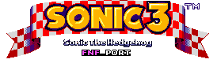
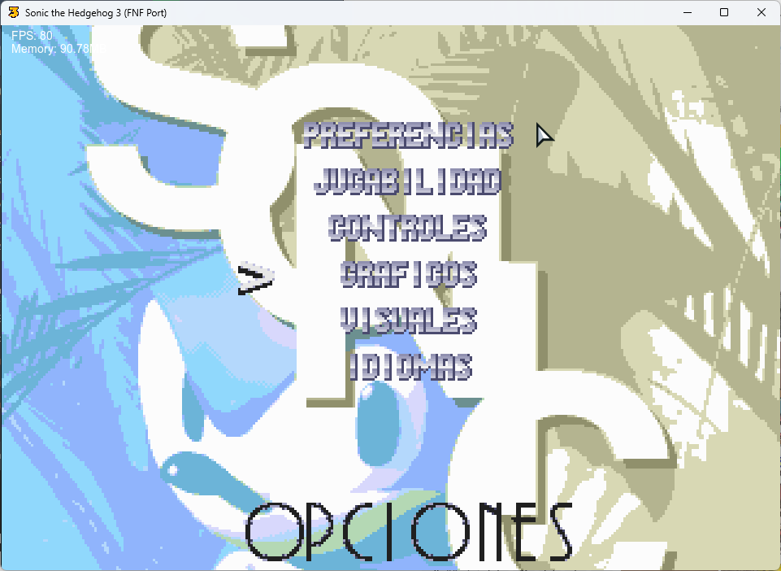
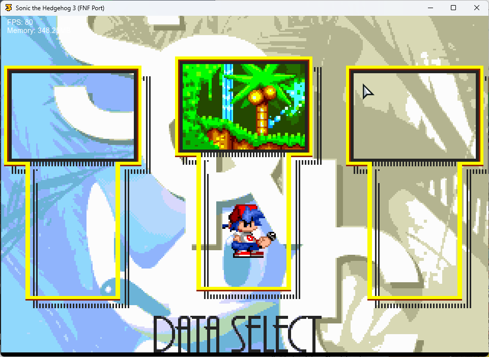
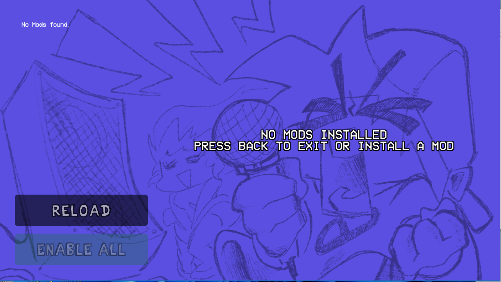
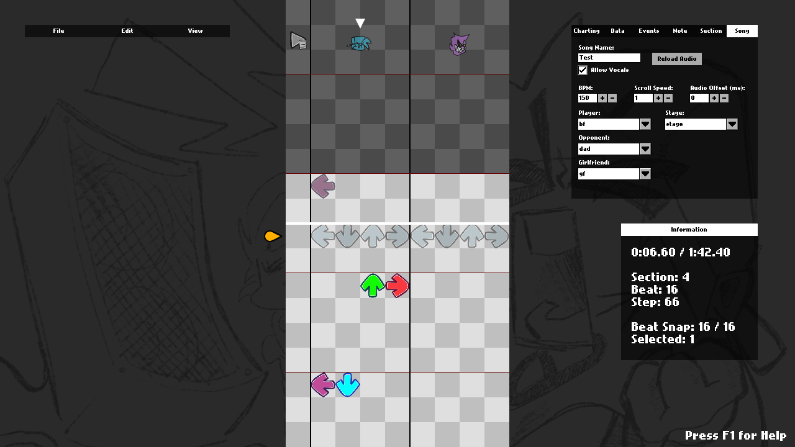
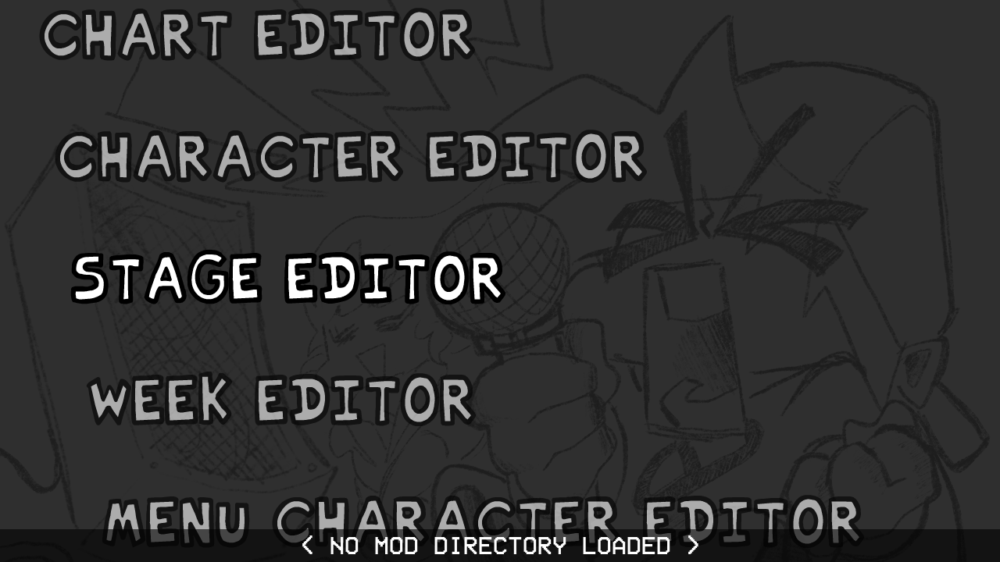
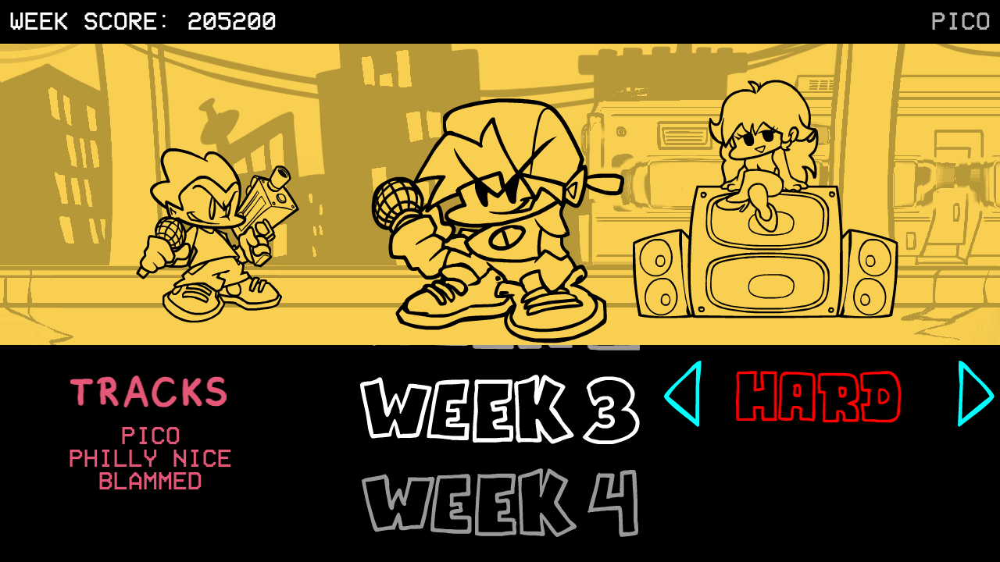
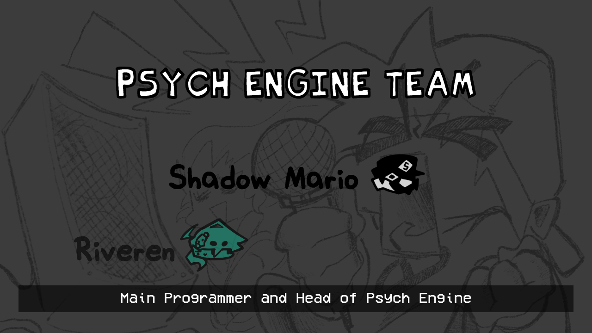
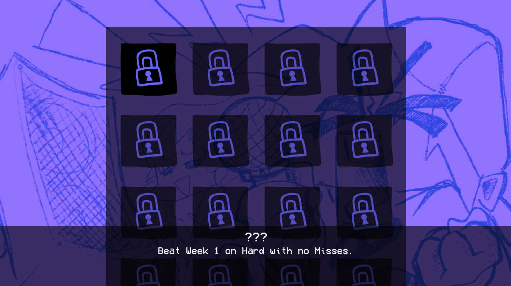

Engine originally used on [Mind Games Mod](https://gamebanana.com/mods/301107), intended to be a fix for the vanilla version's many issues while keeping the casual play aspect of it. Also aiming to be an easier alternative to newbie coders.

## Installation:

Refer to [the Build Instructions](/docs/BUILDING.md)

## Customization:

If you wish to disable things like *Lua Scripts* or *Video Cutscenes*, you can refer to the `Project.xml` file.

Inside `Project.xml`, you will find several variables to customize Psych Engine to your liking.

To start you off, disabling *Video Cutscenes* should be simple, simply delete the line `"VIDEOS_ALLOWED"` or comment it out by wrapping the line in XML-like comments, like this: `<!-- YOUR_LINE_HERE -->`

Same goes for *Lua Scripts*, comment out or delete the line with `LUA_ALLOWED`, this and other customization options are all available within the `Project.xml` file.

## Softcoding (.lua/.hx)
For this you can head over to [the wiki](https://shadowmario.github.io/psychengine.lua)

There you can learn how to use the 212 PlayState funcions in your mod!

## Credits:
* LavatheFox - Main Programmer and Head of Sonic the Hedgehog 3 FNF Port.
* DanDaniel - Main Pixel Artist/Animator, Composer and Charter of Sonic the Hedgehog 3 FNF Port.

### Special Thanks
* DanDaniel - Pixel Artist/Animator, Composer and Charter.
* SirMania - Composer.
* Juanetes - Charter.
* R?Bluezin - Playtester.

***

# Features

## New Sonk Options:

## New Data Select
* A Data Select that's 95% faithful to Sonic the Hedgehog 3, which brings back even more nostalgia for those who played it on the Sega Genesis (or Mega Drive, as we call it in Brazil).

## Mod Support
* Probably one of the main points of this engine, you can code in .lua files outside of the source code, making your own weeks without even messing with the source!
* Comes with a Mod Organizing/Disabling Menu.

## We made a change to the first song, and another secret song will be added/unlocked:
### Too Slow:
  * New BF and Sonic.exe sprites 
  * New Stage Background and events
  * Sonic 3 (before), Sonic CD (new), Sonic the Hedgehog 2 (new addition) and Sonic the Hedgehog 1 (new too) Title Cards
### ???:
  * M???n Sprites
  * New chart and events
  * I dunno 

## Cool new Chart Editor changes and countless bug fixes

* You can now chart "Event" notes, which are bookmarks that trigger specific actions that usually were hardcoded on the vanilla version of the game.
* Your song's BPM can now have decimal values
* You can manually adjust a Note's strum time if you're really going for milisecond precision
* You can change a note's type on the Editor, it comes with five example types:
  * Alt Animation: Forces an alt animation to play, useful for songs like Ugh/Stress
  * Hey: Forces a "Hey" animation instead of the base Sing animation, if Boyfriend hits this note, Girlfriend will do a "Hey!" too.
  * Hurt Notes: If Boyfriend hits this note, he plays a miss animation and loses some health.
  * GF Sing: Rather than the character hitting the note and singing, Girlfriend sings instead.
  * No Animation: Character just hits the note, no animation plays.

## Multiple editors to assist you in making your own Mod

* Working both for Source code modding and Downloaded builds!

## Story mode menu rework:

* Added a different BG to every song (less Tutorial)
* All menu characters are now in individual spritesheets, makes modding it easier.

## Credits menu

* You can add a head icon, name, description and a Redirect link for when the player presses Enter while the item is currently selected.

## Awards/Achievements
* The engine comes with 16 example achievements that you can mess with and learn how it works (Check Achievements.hx and search for "checkForAchievement" on PlayState.hx)

## Other gameplay features:
* When the enemy hits a note, their strum note also glows.
* Lag doesn't impact the camera movement and player icon scaling anymore.
* Some stuff based on Week 7's changes has been put in (Background colors on Freeplay, Note splashes)
* You can reset your Score on Freeplay/Story Mode by pressing Reset button.
* You can listen to a song or adjust Scroll Speed/Damage taken/etc. on Freeplay by pressing Space.
* You can enable "Combo Stacking" in Gameplay Options. This causes the combo sprites to just be one sprite with an animation rather than sprites spawning each note hit.

#### Sonic the Hedgehog 3 FNF Port by LavatheFox, Psych Engine' by shadowmario, Friday Night Funkn' by ninjamuffin99
